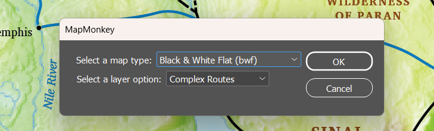
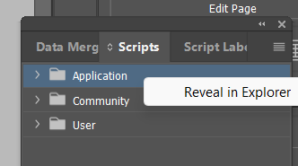

# 

# **MapMonkey**

[Current Version: 2025-04-09](#version-history)

MapMonkey is a tool that makes it quick and easy to “monkey” with various map options supported by InDesign maps in the SIL Map Repository:

* Many maps support different map types, such as “full color relief” and “black and white flat”.  
* A few maps have additional options. For example, the world locator inset on the combined map of Paul’s journeys can be flipped to be Pacific-centric.

Manually adjusting the map for these options manually can require turning multiple layers on or off, and redefining paragraph styles that use blue or brown color swatches to use gray swatches instead.

MapMonkey does all this for you through a simple dialog. For example:

Note: We anticipate enabling MapMonkey to manage switching a map between different writing system settings, so check back later for that.

## Download and Installation

To install MapMonkey, first download [MapMonkey.jsx](https://drive.google.com/file/d/11ce2Qlwj9zYRk8-4wZy2sczGRDfF8qAd/view?usp=drive_link). 

You can find more detailed online guides for installing InDesign scripts, but in a nutshell:

* Open the Scripts panel. (Window \> Utilities \> Scripts)  
* Right-click on the Application folder, and select “Reveal in Explorer”.  
    
* Move MapMoney.jsx from wherever you downloaded it into the “Scripts Panel” folder.  
  

To run the MapMonkey script, simply double-click on the MapsMonkey.jsx item that now appears in the Scripts panel.  

Have fun monkeying\!

## Version History {#version-history}

| 2025-04-09 | Added support for versions of InDesign back to CS5 |
| :---- | :---- |
| 2025-04-04 | Added support for MCR map types |
| 2025-03-14 | Initial release |
